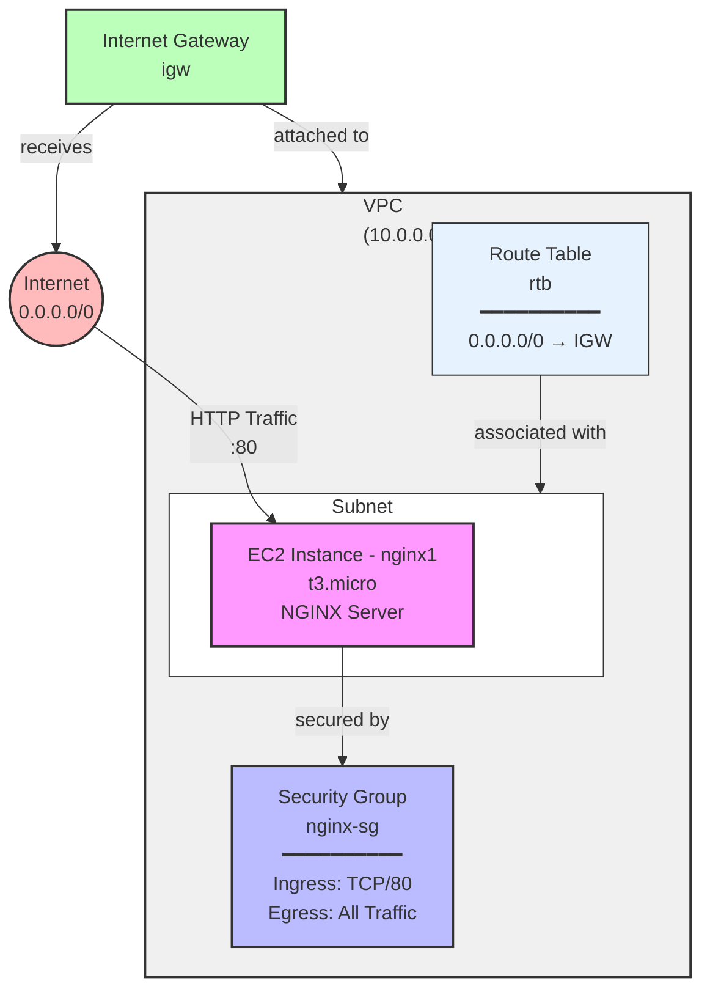

# AWS terraform playground

Use `aws configure` to [configure the AWS connection](https://docs.aws.amazon.com/cli/latest/userguide/cli-authentication-user.html#cli-authentication-user-configure-csv.titlecli-authentication-user-mfa).

Verify it is properly configured by executing `aws ec2 describe-instances`

## Infrastructure Architecture


## Configure
Create a file named `terraform.tfvars` with this content:
```tfvars
aws_access_key = "YOUR-ACCESS-KEY"
aws_secret_key = "YOUR-SECRET-KEY"
```

Or export them as env vars:
```env
TF_VAR_aws_access_key = "YOUR-ACCESS-KEY"
TF_VAR_aws_secret_key = "YOUR-SECRET-KEY"
```

You can also customize variables by passing them as `-var` to the terraform cli:
```sh
terraform plan \
  -var=billing_code="F0000" \
  -var=project="my-web"
```

## Deploy

Execute:
```bash
terraform init
terraform plan -out d1.tfplan
```

Review the plan then:
```bash
terraform apply d1.tfplan
```

Destroy all resurces:
```bash
terraform destroy
```
