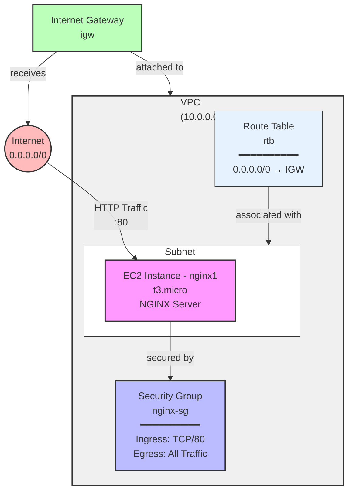

# AWS terraform playground

Use `aws configure` to [configure the AWS connection](https://docs.aws.amazon.com/cli/latest/userguide/cli-authentication-user.html#cli-authentication-user-configure-csv.titlecli-authentication-user-mfa).

Verify it is properly configured by executing `aws ec2 describe-instances`

## Infrastructure Architecture


## Configure
Create a file named `terraform.tfvars` with this content:
```tfvars
aws_access_key = "YOUR-ACCESS-KEY"
aws_secret_key = "YOUR-SECRET-KEY"
```

Or export them as env vars:
```env
TF_VAR_aws_access_key = "YOUR-ACCESS-KEY"
TF_VAR_aws_secret_key = "YOUR-SECRET-KEY"
```

You can also customize variables by passing them as `-var` to the terraform cli:
```sh
terraform plan \
  -var=billing_code="F0000" \
  -var=project="my-web"
```

## Deploy

Execute:
```bash
terraform init
terraform plan -out d1.tfplan
```

Review the plan then:
```bash
terraform apply d1.tfplan
```

Destroy all resurces:
```bash
terraform destroy
```

### Debugging

You can execute dig to find out the dns in the output:
```sh
⬢ [Docker] ❯ dig ec2-13-60-19-147.eu-north-1.compute.amazonaws.com

; <<>> DiG 9.18.39-0ubuntu0.24.04.2-Ubuntu <<>> ec2-13-60-19-147.eu-north-1.compute.amazonaws.com
;; global options: +cmd
;; Got answer:
;; ->>HEADER<<- opcode: QUERY, status: NOERROR, id: 45996
;; flags: qr rd ra; QUERY: 1, ANSWER: 1, AUTHORITY: 0, ADDITIONAL: 0

;; QUESTION SECTION:
;ec2-13-60-19-147.eu-north-1.compute.amazonaws.com. IN A

;; ANSWER SECTION:
ec2-13-60-19-147.eu-north-1.compute.amazonaws.com. 0 IN A 13.60.19.147

;; Query time: 20 msec
;; SERVER: 192.168.5.2#53(192.168.5.2) (UDP)
;; WHEN: Sun Mar 01 10:37:33 UTC 2026
;; MSG SIZE  rcvd: 132
```

And you can also execute a curl:
```sh
⬢ [Docker] ❯ curl -v ec2-13-60-19-147.eu-north-1.compute.amazonaws.com
* Host ec2-13-60-19-147.eu-north-1.compute.amazonaws.com:80 was resolved.
* IPv6: (none)
* IPv4: 13.60.19.147
*   Trying 13.60.19.147:80...
* connect to 13.60.19.147 port 80 from 172.17.0.2 port 50532 failed: Connection refused
* Failed to connect to ec2-13-60-19-147.eu-north-1.compute.amazonaws.com port 80 after 68 ms: Couldn't connect to server
* Closing connection
curl: (7) Failed to connect to ec2-13-60-19-147.eu-north-1.compute.amazonaws.com port 80 after 68 ms: Couldn't connect to server
```